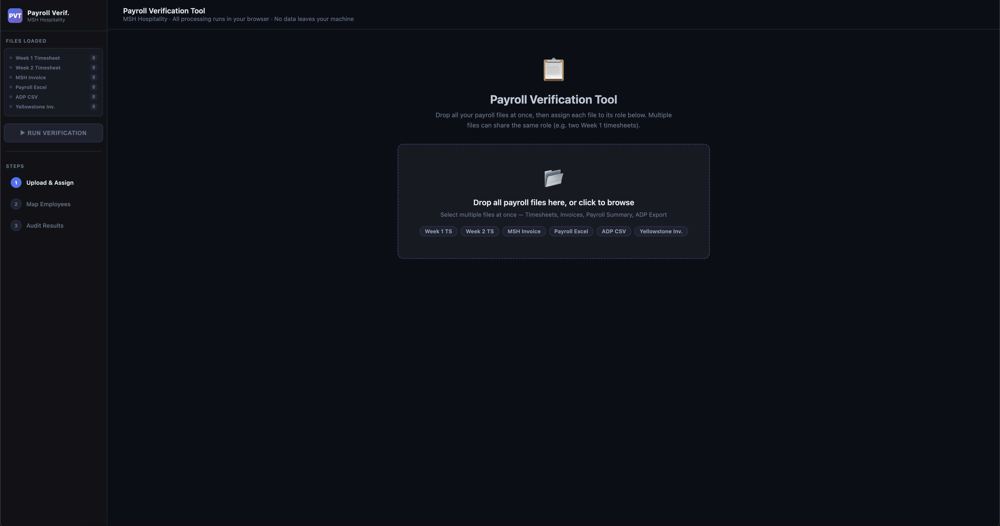

# MSH Payroll Verification Tool

A web-based tool for verifying payroll data across multiple sources including timesheets, invoices, and ADP exports for MSH Hospitality.

## Features

- **File Upload & Detection**: Automatically detects and categorizes uploaded files (timesheets, invoices, payroll summaries, ADP CSV exports).
- **Data Parsing**: Parses Excel and CSV files using XLSX library.
- **Audit & Verification**: Compares hours, pay rates, and totals across different data sources to identify discrepancies.
- **Normalization**: Normalizes department names, employee names, and descriptions for consistent comparison.
- **Reporting**: Generates detailed audit reports with color-coded discrepancies.
- **User-Friendly Interface**: Clean, responsive web interface with sidebar file summary.

## Installation

1. Clone the repository:
   ```bash
   git clone https://github.com/ubaidullah-se/msh-payroll-verification-tool.git
   cd msh-payroll-verification-tool
   ```

2. Install dependencies:
   ```bash
   npm install
   ```

## Usage

1. Start the development server:
   ```bash
   npm run dev
   ```

2. Open your browser and navigate to `http://localhost:5173/`.

3. Upload files by dragging and dropping or selecting them in the interface.

4. The tool will automatically detect file types and process them.

5. Review the audit results in the main panel.

## Build for Production

To build the project for production:

```bash
npm run build
```

This will generate optimized files in the `dist/` directory.

## Preview Production Build

After building, you can preview the production build:

```bash
npm run preview
```

## Screenshot



*Take a screenshot of the application running in your browser and save it as `screenshot.png` in the root directory.*

## Technologies Used

- **Vite**: Build tool and development server
- **XLSX**: Excel file parsing library
- **JavaScript (ES6+)**: Core logic
- **HTML5 & CSS3**: User interface

## Contributing

1. Fork the repository
2. Create a feature branch (`git checkout -b feature/new-feature`)
3. Commit your changes (`git commit -am 'Add new feature'`)
4. Push to the branch (`git push origin feature/new-feature`)
5. Create a Pull Request
